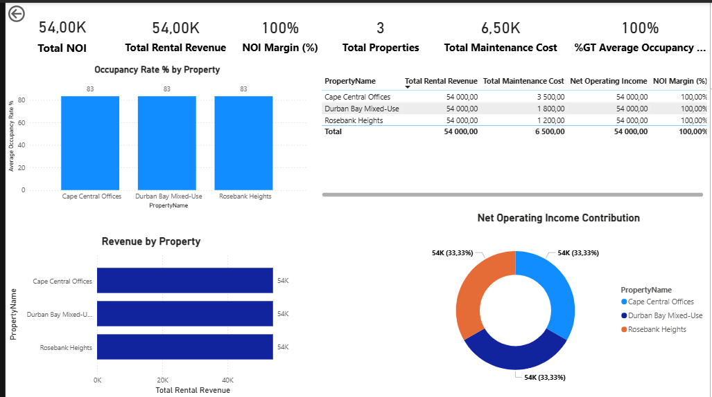
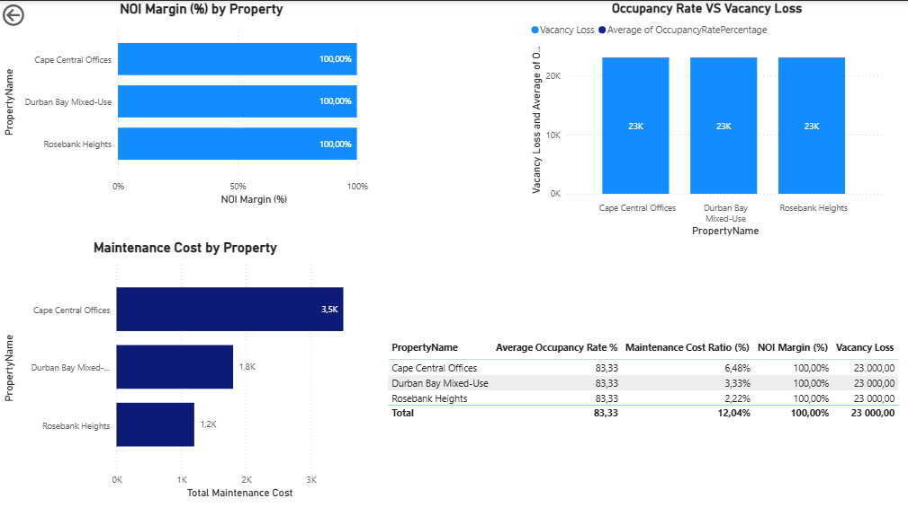

# 🏢 Project 10: Property & REIT Portfolio Analytics

## 📌 Overview

This project analyzes a simulated Property & Real Estate Investment Trust (REIT) portfolio using SQL and Power BI.

The objective was to evaluate:

- Rental revenue performance
- Net Operating Income (NOI)
- Occupancy rates
- Maintenance cost impact
- Portfolio yield
- Property-level profitability

This project demonstrates advanced SQL view creation, financial performance modeling, and executive-level Power BI dashboard design.

---

## 🛠 Tech Stack

- SQL Server (Data Modeling & Analytical Views)
- Power BI (DAX & Dashboard Development)
- Git & GitHub (Version Control)

---

## 🗄 Data Model

Relational database structured around:

- Properties
- Units
- Tenants
- Lease Agreements
- Rent Payments
- Property Valuations
- Maintenance Costs

---

## 📊 Analytical SQL Views Created

- `vw_Property_Revenue`
- `vw_Property_NOI`
- `vw_Property_Occupancy`
- `vw_Property_Yield`
- `vw_Vacancy_Loss`
- `vw_Property_Maintenance_Cost`

These views were imported into Power BI for financial modeling and dashboard visualization.

---

# 📊 Dashboard Pages

---

## 🏢 Executive Property Overview

### Key Metrics Displayed:
- Total Portfolio Revenue
- Net Operating Income (NOI)
- NOI Margin
- Portfolio Yield
- Vacancy Loss
- Occupancy Rate

This dashboard provides a high-level executive summary of portfolio health.

---

## 📈 Portfolio Performance

### Key Insights:
- Revenue by Property
- NOI by Property
- Maintenance Cost by Property
- Yield Comparison
- Performance benchmarking across properties

This page allows property-level financial comparison and performance evaluation.

---

## 📈 Key Business Insights

- Identified high and low-performing properties based on NOI margin
- Measured the financial impact of vacancy rates
- Compared yield performance across the portfolio
- Assessed maintenance cost pressure on profitability
- Evaluated overall portfolio stability and revenue concentration

---

## 🔗 Connect With Me

GitHub: https://github.com/BoiketloTLorekang  
LinkedIn: https://www.linkedin.com/in/boiketlo-lorekang-931337241/

---

## 🎯 Author

**Boiketlo Lorekang**  
Data Analyst | Business Intelligence | Financial Analytics  

Industries covered in portfolio:  
Retail | Marketing | Logistics | Agriculture | Property (REIT)

---

## 🚀 Project Status

Completed – End-to-End SQL + Power BI Analytics Project

